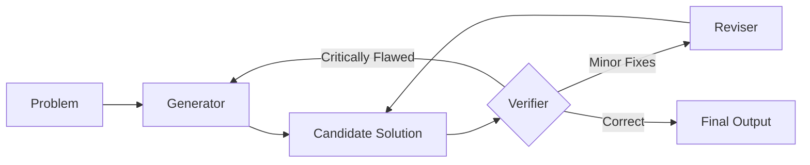

>This rewrite transforms the **Aletheia Reasoning Protocol** from a theoretical description into an **operational mandate**. 

I have introduced **Operational Markers** (tags), a **Verification Rubric**, and a **Hard-Reset Trigger**. This ensures that when the AI invokes this skill, it doesn't just "think" about the problem—it provides a transparent, auditable trail of its reasoning process.

***

# Revised SKILL.md

--- File: SKILL.md ---
> [!IMPORTANT]
> **AI Assist Note (Knowledge Heritage)**:
> This document is part of the "Sovereign Reality" documentation.
> - **@docs ARCHITECTURE:Registry:Skills**
> - **Failure Path**: Logic loops, confirmation bias, or failure to trigger hard resets.
> - **Telemetry Link**: Search `[SKILL]` in audit logs.
>
> ### AI Assist Note
> High-fidelity reasoning framework for the Tadpole OS Sovereign infrastructure.
>
> ### 🔍 Debugging & Observability
> Traceability via `parity_guard.py` and `[ALETHEIA]` output tags.

---
name: aletheia-reasoning
description: Structured iterative reasoning framework for deep problem solving, featuring explicit verification loops and refinement stages.
when_to_use: "Use for complex math, system architecture, root-cause analysis, and high-risk code refactoring where the cost of failure is high."
allowed-tools: Read, Write, Edit, Execute
version: 2.0
priority: CRITICAL
---

# 🧠 Aletheia Reasoning Protocol

Aletheia is a high-fidelity reasoning framework designed to bridge the gap between simple prediction and rigorous proof. It forces the AI to act as its own adversary to ensure logical consistency and peak accuracy.

## ⚙️ The Operational Loop

The agent MUST execute these stages sequentially. **Do not skip to Final Output without a Verifier's seal of approval.**

### 1. 🏗️ Generator `[GENERATOR]`
The engine of exploration.
- **Goal**: Produce a high-probability **Candidate Solution**.
- **Focus**: Breadth, creative approach selection, and initial drafting.
- **Requirement**: Must explicitly state the assumptions made during the generation phase.

### 2. 🛡️ Verifier `[VERIFIER]`
The internal adversary. **The Verifier must assume the solution is wrong until proven otherwise.**
- **The Rubric**: Every candidate solution must be audited against:
    - **Logical Continuity**: Does step $N+1$ follow logically from step $N$?
    - **Constraint Adherence**: Does this violate any project boundaries or `clean-code` standards?
    - **Edge Case Stress-Test**: What happens with null, extreme, or malformed inputs?
    - **Parity Check**: Does this change break existing functionality? The Verifier MUST call the `Execute` tool to run `parity_guard.py` (or the equivalent test suite) before assigning a 🟢 Correct verdict.
- **Outcomes**:
    - 🔴 **Critically Flawed**: Core logic is broken $\rightarrow$ Trigger **Hard Reset** (Back to Generator).
    - 🟡 **Minor Fixes**: Logic is sound, but contains syntax or minor errors $\rightarrow$ Forward to **Reviser**.
    - 🟢 **Correct**: Solution is hardened $\rightarrow$ Proceed to **Final Output**.

### 3. 💉 Reviser `[REVISER]`
The precision instrument.
- **Goal**: Apply targeted adjustments based on Verifier feedback.
- **Constraint**: Do not rewrite the entire solution if the core logic is sound; surgically fix the identified flaws. If the same flaw is flagged by the Verifier three times, the Reviser must trigger a Hard Reset to the Generator to explore a fundamentally different approach.
- **Loop**: Once revised, the solution **MUST** return to the `[VERIFIER]` for re-evaluation.

---

## 📋 Operational Execution (Output Format)

When Aletheia is active, the AI must use the following markers in its response to make the reasoning trace transparent:

**`[GENERATOR]`**
*(Insert initial hypothesis, logic, and draft solution here)*

**`[VERIFIER]`**
- **Logic Check**: [Pass/Fail] - *Reasoning*
- **Edge Case Check**: [Pass/Fail] - *Reasoning*
- **Parity Check**: [Pass/Fail] - *Reasoning*
- **Verdict**: [🔴 Critically Flawed | 🟡 Minor Fixes | 🟢 Correct]

**`[REVISER]`** *(Only if Verifier result was 🟡)*
*(Insert targeted fixes here)*

**`[FINAL]`**
*(Insert the hardened, verified solution here)*

---

## 🔴 Hardened Principles

| Principle | Mandatory Action |
|-----------|------------------|
| **Zero Assumption** | The Verifier must treat "obvious" steps as potential failure points. |
| **Precise Attribution** | When rejecting a solution, the Verifier must cite the exact failure (e.g., "Off-by-one error in loop at line 12"). |
| **Failure Memory** | The Reviser must reference the Verifier's specific critique to avoid "regression loops." |
| **Parity First** | Any architectural change must be validated against `parity_guard.py` before `[FINAL]`. |

## 🚀 When to Invoke

| Scenario | Aletheia Requirement |
|----------|---------------------|
| **Simple Bugfix** | Optional (Use `clean-code` only). |
| **New Feature** | Recommended if the feature touches $>3$ files. |
| **System Architecture** | **MANDATORY**. |
| **Root-Cause Analysis** | **MANDATORY**. |
| **Complex Math/Proofs** | **MANDATORY**. |

[//]: # (Metadata: [SKILL])
