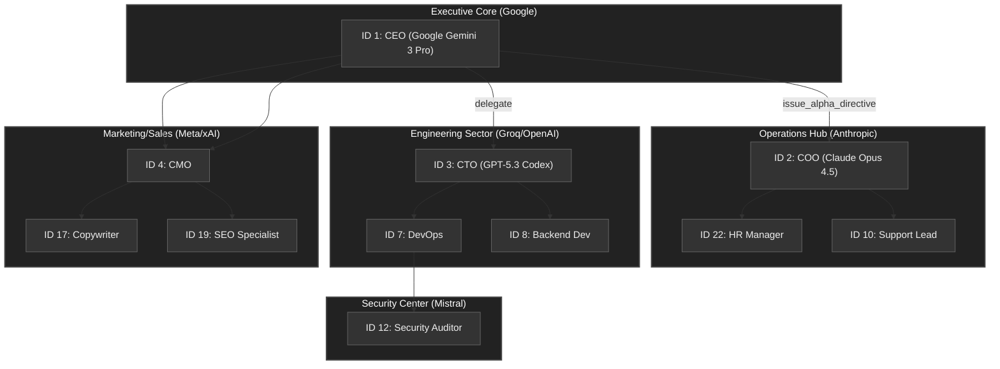

> [!IMPORTANT]
> **AI Assist Note (Knowledge Heritage)**:
> This document is part of the "Sovereign Reality" documentation.
> - **@docs ARCHITECTURE:Core**
> - **Failure Path**: Information drift, legacy terminology, or documentation mismatch.
> - **Telemetry Link**: Search `[README]` in audit logs.
>
> ### AI Assist Note
> Core technical resource for the Tadpole OS Sovereign infrastructure.
>
> ### 🔍 Debugging & Observability
> Traceability via `parity_guard.py`.

<div align="center">
  

  # 🐸 AI-Tadpole-OS
  ### **Sovereign Intelligence. Deterministic Execution. Zero Data Leaks.**

  **The high-performance, local-first runtime for orchestrating autonomous multi-agent swarms.**

  [](https://www.rust-lang.org/)
  [](https://react.dev/)
  [](https://tailwindcss.com/)
  [](https://github.com/DDS-Solutions/AI-Tadpole-OS/actions/workflows/ci.yml)
  [](docs/Security_Model.md)
  [](docs/Security_Model.md#1-security-policy-the-rules)
  [](LICENSE)

  [🚀 Start a Mission](docs/TEST_MISSIONS.md) • [🏗️ Architecture Hub](docs/ARCHITECTURE.md) • [🛡️ Security Model](docs/Security_Model.md) • [💬 Join Discussions](https://github.com/DDS-Solutions/AI-Tadpole-OS/discussions)

  ---
</div>

AI-Tadpole-OS is a local-first runtime for orchestrating autonomous teams of AI agents — **without sending your data to the cloud.** Define a goal, assign a hierarchy of specialized agents, and watch the engine coordinate them in parallel. 

Designed for teams requiring **uncompromising data sovereignty**, Tadpole OS bridges the gap between probabilistic LLM outputs and deterministic business logic.

---

## 🛡️ Sovereignty starts with a Clone
In a world of "AI-as-a-Service," true independence is a local copy. We prioritize **Git Clones** because a clone is the ultimate act of data sovereignty:
- **Total Ownership**: No one can "unplug" your intelligence stack.
- **Privacy by Default**: Your data never leaves your infrastructure.
- **Air-Gapped Ready**: Run missions in completely disconnected environments.
- **Deterministic Control**: You own the code, the directives, and the memory.

**Clone the repo. Own your intelligence.**

---

## 🏗️ The 3-Layer Architecture
*Why Tadpole OS is more reliable than a standard agent wrapper.*

| Layer | Component | Purpose |
| :--- | :--- | :--- |
| **L1: Directive** | `directives/` | **Intent**: Human-defined SOPs and goals. Non-negotiable rules for the swarm. |
| **L2: Orchestration** | `Agent 99` | **Decision**: Intelligent routing, self-correction, and wisdom extraction. |
| **L3: Execution** | `execution/` | **Action**: Deterministic Python/Rust scripts. No "hallucinated" code execution. |

---

## 🧠 Feature Spotlight: Agent 99 (Self-Annealing)
**The system that learns from its own history.**

Tadpole OS doesn't just run tasks; it performs **Self-Annealing**. After every mission, **Agent 99** autonomously:
1.  **Extracts Architectural Wisdom**: Analyzes logs to find what worked and what didn't.
2.  **Updates Institutional Memory**: Writes learnings back to `LONG_TERM_MEMORY.md`.
3.  **Refines Protocols**: Adjusts its own directives to prevent future drift.

---

## 🧩 Core Capability Pillars

<details open>
<summary><b>🖥️ 1. Reactive Interface & Observability</b></summary>

Built for high-density swarm oversight with sub-millisecond telemetry.
- **Detachable Portals**: Spread tactical sectors across multiple physical displays.
- **10Hz Swarm Pulse**: Real-time MessagePack telemetry for agent performance.
- **God-View Visualizer**: High-performance 2D Force-Graph of your agent hierarchy.
- **Hardware Telemetry**: Real-time CPU, RAM, and Process load visualization.
</details>

<details>
<summary><b>🤖 2. Multi-Agent Swarm Orchestration</b></summary>

Hierarchical coordination powered by a Rust-native engine.
- **CEO/COO Patterns**: Strategic-to-tactical delegation protocols.
- **Parallel Swarming**: High-throughput sub-agent recruitment via `FuturesUnordered`.
- **Triple-Slot Routing**: Primary, Secondary, and Tertiary model slots per agent.
- **Autonomic Fallback**: Self-healing quantization adjustment on hardware limits.
</details>

<details>
<summary><b>🧠 3. Memory & Persistent RAG</b></summary>

Split-brain architecture for semantic and relational data.
- **LanceDB Vector Store**: Cross-session institutional knowledge.
- **Mission Sandboxing**: Localized RAG scopes that cleanup automatically on completion.
- **Hybrid Search**: Combines SQLite deterministic logs with high-dimensional embeddings.
</details>

<details>
<summary><b>🛡️ 4. Security & Sovereign Compliance</b></summary>

Zero-trust governance with human-in-the-loop gates.
- **Sapphire Shield**: Flags `budget:spend` and `shell:execute` for manual approval.
- **Hard Privacy Gate**: Explicitly blocks external traffic for 100% air-gapped runs.
- **OBLITERATUS Hardening**: 100% audit-verified code paths and Merkle trails.
</details>

---

## 🚀 Quick Start (60 Seconds)

### 1. Prerequisites
- **Rust (1.80+)** & **Node.js 20+**
- **Ollama** (for local models) or an **API Key** (OpenAI, Anthropic, Google, Groq).

### 2. Installation
```bash
# Clone and install dependencies
git clone https://github.com/DDS-Solutions/AI-Tadpole-OS.git
cd AI-Tadpole-OS
npm install

# Setup environment
cp .env.example .env
# Edit .env and set your NEURAL_TOKEN and API Keys
```

### 3. Launch the Swarm
```bash
# Terminal A: Start the Rust Engine
npm run engine

# Terminal B: Start the React Dashboard
npm run dev
```

---

## 🛰️ Scalability & Topology: The Max-Scale Swarm
*Visualizing what a Full-Capacity Swarm (10 Clusters, 25 Agents) looks like.*

<details>
<summary><b>View Swarm Hierarchy Diagram</b></summary>



### Resource Allocation Matrix (Sample)
| Cluster | Focus | Provider | Model Capacity |
| :--- | :--- | :--- | :--- |
| **Executive Core** | Strategic Direction | **Google** | Pro / Flash |
| **Operations Hub** | Orchestration | **Anthropic** | Opus / Sonnet |
| **Engineering Sector** | Implementation | **Groq / OpenAI** | Llama / Codex |
| **Security Center** | Auditing | **Mistral** | Medium / Large |

</details>

---

## 🏭 Industry-Specific Solutions
Deploy specialized "One-Click" swarms for your sector.

- **💸 Finance**: Automated bookkeeping and real-time audit trails.
- **📣 Marketing**: Full-funnel content and SEO optimization.
- **⚖️ Legal/Medical**: Compliance-first intake and document review swarms.
- **🏭 Manufacturing**: Multi-tier templates for Job Shops to Smart Factories.

[👉 Explore the Template Registry](https://github.com/DDS-Solutions/Tadpole-OS-Industry-Templates)

---

## 🔱 Sovereign Forking Protocol
Tadpole OS is built to be forked. Create your own tactical branch:
1. **Fork this Repository** to your own account.
2. **Customize Agents** via the SQLite database or Swarm Templates.
3. **Deploy** using the provided `deploy-bunker.ps1` scripts.

---

<div align="center">
  <sub>Built with ❤️ by the <b>DDS Solutions</b> Team.</sub>
  <br />
  <sub>Licensed under MIT. Sovereign Intelligence for all.</sub>
</div>

[//]: # (Metadata: [README])


[//]: # (Metadata: [README])

[//]: # (Metadata: [README])
