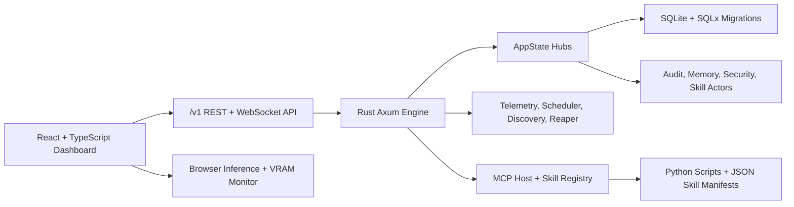

> [!IMPORTANT]
> **AI Assist Note (Knowledge Heritage)**:
> This document is part of the "Sovereign Reality" documentation.
> - **@docs ARCHITECTURE:Core**
> - **Failure Path**: Information drift, legacy terminology, or documentation mismatch.
> - **Telemetry Link**: Search `[README]` in audit logs.
>
> ### AI Assist Note
> Core technical resource for the Tadpole OS runtime, dashboard, Rust engine, and Python execution layer.
>
> ### Debugging & Observability
> Traceability via `execution/parity_guard.py`.

<div align="center">

# Autonomous Agentic Tadpole

**A local-first operating system for autonomous agent swarms, governed execution, model operations, and live mission telemetry.**

[](https://www.rust-lang.org/)
[](https://react.dev/)
[](https://www.typescriptlang.org/)
[](https://vite.dev/)
[](https://www.sqlite.org/)

[Quick Start](#quick-start) • [Architecture](#architecture) • [API](#api) • [Configuration](#configuration) • [Verification](#verification)

</div>

## Why This Exists

Most agent frameworks stop at prompt orchestration. Autonomous Agentic Tadpole goes further: it combines a Rust control plane, a production-grade React operations console, SQLite-backed persistence, governance gates, skill execution, MCP tooling, model-provider management, and live telemetry into one local-first system.

The result is a desktop-ready agent operations platform that can run missions, manage agent state, inspect model providers, schedule continuity jobs, surface security posture, and keep a durable audit trail without depending on a hosted control plane.

## What It Does

- **Runs a Rust agent engine** with Axum, Tokio, background actors, lifecycle workers, and protected `/v1` APIs.
- **Ships a real operations dashboard** built with React 19, TypeScript, Vite, Tailwind CSS, Zustand, and React Router.
- **Persists operational state locally** with SQLite migrations through SQLx.
- **Executes skills and tools** through Python scripts, JSON manifests, modular `execution/core/` skills, and MCP endpoints.
- **Manages providers and models** across local and cloud backends, with Ollama support and provider-key configuration.
- **Streams telemetry live** through WebSocket routes, heartbeat events, system logs, and dashboard health panels.
- **Enforces governance and security controls** through bearer-token auth, request middleware, shell scanning, audit trails, quotas, oversight queues, and privacy-mode behavior.
- **Visualizes codebase interdependencies** with an interactive 2D Force-Directed Knowledge Graph and down-stream blast-radius impact analysis.
- **Keeps optional heavy features explicit**: vector memory and neural audio are Cargo features, disabled by default for lightweight local builds.

## System At A Glance



## Quick Start

Prerequisites:

- Node.js and npm compatible with the checked-in `package-lock.json`.
- Rust toolchain for `server-rs`.
- Python 3 for scripts in `execution/`.
- Optional: Ollama or cloud provider API keys for model execution.

Install dependencies:

```bash
npm install
```

Create local environment config:

```bash
cp .env.example .env
```

Set one engine token in `.env`:

```ini
NEURAL_TOKEN=your-secret-token
```

Start the Rust engine:

```bash
npm run engine
```

Start the dashboard in a second terminal:

```bash
npm run dev
```

Open:

- Dashboard: `http://localhost:5173`
- Engine health: `http://127.0.0.1:8000/v1/engine/health`

On Windows, these helpers wrap the same flow:

- `start_AA_tadpole.bat`
- `start_backend.bat`
- `start_frontend.bat`
- `stop_AAtadpole.bat`

## Architecture

Autonomous Agentic Tadpole has three practical runtime layers.

| Layer | Code | Responsibility |
| --- | --- | --- |
| Interface | `src/` | Dashboard shell, pages, stores, services, browser monitoring, provider sync, detached views |
| Engine | `server-rs/src/` | Axum routes, AppState, actors, middleware, telemetry, agent runner, security, startup workers |
| Execution | `execution/` | Python tools, MCP server, JSON skill definitions, verification scripts, modular skill framework |

The engine boot path starts in `server-rs/src/main.rs`, initializes environment and tracing, creates `AppState`, starts background workers, spawns system actors, launches the orchestrator, and binds Axum on `127.0.0.1:8000` unless configured otherwise.

`server-rs/src/router.rs` assembles all `/v1` API routes. Public engine health and WebSocket routes remain open; management routes require `Authorization: Bearer <NEURAL_TOKEN>`. When `dist/` exists, the same Rust process serves the built React app with SPA fallback.

## Repository Map

| Path | Purpose |
| --- | --- |
| `src/` | React dashboard, stores, hooks, components, services, contracts, pages, tests |
| `server-rs/src/` | Rust API, agent runner, AppState hubs, actors, middleware, routes, telemetry, security |
| `server-rs/migrations/` | SQLite schema migrations |
| `execution/` | Python execution layer, MCP host, skill manifests, verification and audit utilities |
| `execution/core/` | Modular skill framework foundation |
| `directives/` | Governance, identity, orchestration, and provider operating instructions |
| `docs/` | Architecture, operations, API reference, OpenAPI, and security docs |
| `data/` | Local runtime data, including the default `tadpole.db` |
| `dist/` | Production dashboard build served by the Rust engine |
| `tests/` | Shared frontend test setup and e2e support |

## Dashboard Surface

Navigation is defined in `src/constants/routes.ts`.

| URL | View |
| --- | --- |
| `/dashboard` | Operations dashboard |
| `/org-chart` | Hierarchy |
| `/standups` | Standups |
| `/workspaces` | Workspaces |
| `/missions` | Missions |
| `/models` | Model manager |
| `/agents` | Agent manager |
| `/engine` | Engine dashboard |
| `/oversight` | Oversight |
| `/skills` | Skills |
| `/benchmarks` | Benchmarks |
| `/scheduled-jobs` | Jobs |
| `/infra/model-store` | Intelligence store |
| `/docs` | Documentation |
| `/settings` | Settings |
| `/store` | Template store |
| `/security` | Security |
| `/governance` | Governance |

Detached windows are available at `/detached-view`, `/detached/swarm-pulse`, and `/detached/chat`.

## API

The Rust engine binds to `127.0.0.1:8000` by default. All application APIs are nested under `/v1`.

Public routes:

| Method | Route | Purpose |
| --- | --- | --- |
| `GET` | `/v1/engine/health` | Engine health check |
| `GET` | `/v1/engine/ws` | Engine WebSocket stream |
| `GET` | `/v1/engine/live-voice` | Live voice WebSocket stream |

Protected route groups:

| Prefix | Purpose |
| --- | --- |
| `/v1/agents` | Agent CRUD, graph, tasks, pause/resume, memory |
| `/v1/oversight` | Decisions, ledger, quotas, audit trail, health, policy |
| `/v1/infra` | Node discovery and infrastructure nodes |
| `/v1/model-manager` | Providers, models, catalog, pulls, provider tests |
| `/v1/skills` | Skill manifests, MCP tools, imports, promotion, scripts, workflows, hooks |
| `/v1/benchmarks` | Benchmark definitions, runs, and history |
| `/v1/continuity` | Scheduled jobs and workflows |
| `/v1/docs` | Knowledge docs and operations manual |
| `/v1/system` | Compute profile and system introspection |
| `/v1/governance` | Blueprints and sovereign manifest |
| `/v1/sovereign` | Mission session tree and branch state |
| `/v1/intelligence` | High-fidelity symbol graph mapping and dependent blast-radius analytics |
| `/v1/search/memory` | Global memory search |
| `/v1/env-schema` | Runtime environment schema |
| `/v1/engine/*` | Deploy, kill, shutdown, transcribe, speak, template install |
| `/v1/mcp/*` | MCP SSE and message bridge |

Protected routes require:

```http
Authorization: Bearer <NEURAL_TOKEN>
```

Memory endpoints return `501 Not Implemented` unless the Rust `vector-memory` feature is enabled.

## Scripts

| Command | Purpose |
| --- | --- |
| `npm run dev` | Start Vite on port 5173 |
| `npm run engine` | Run the Rust engine via Cargo |
| `npm run build` | Type-check and build the frontend |
| `npm run lint` | Run ESLint |
| `npm run test` | Run Vitest |
| `npm run test:coverage` | Run Vitest with coverage |
| `npm run preview` | Preview the Vite build |
| `npm run docs:api` | Regenerate `docs/openapi.yaml` and `docs/API_REFERENCE.md` from `server-rs/src/router.rs` |
| `npm run docs:parity` | Run documentation/API/version parity checks |
| `npm run tauri:dev` | Start Tauri dev mode |
| `npm run tauri:build` | Build Tauri app |
| `npm run docs:dev` | Start VitePress docs |
| `npm run docs:build` | Build VitePress docs |
| `npm run docs:preview` | Preview built docs |
| `npm run version:sync` | Sync `version.json` into manifests and docs |

## Configuration

Common environment variables:

| Variable | Default | Purpose |
| --- | --- | --- |
| `NEURAL_TOKEN` | Required | Bearer token for protected API routes |
| `NEURAL_ENGINE_ACCESS_TOKEN` | Required alternative | Alternate auth token accepted by the engine |
| `ALLOWED_ORIGINS` | Local dev origins | Comma-separated origin allow-list; use `*` only for wildcard troubleshooting with credentials disabled |
| `PORT` | `8000` | Engine port |
| `BIND_ADDRESS` | `127.0.0.1` | Engine bind address |
| `STATIC_DIR` | `dist` | Production static asset directory |
| `WORKSPACE_ROOT` | Current directory | Base path for data, scripts, skills, and panic logs |
| `DATABASE_URL` | `sqlite:<workspace>/data/tadpole.db` | SQLx database URL |
| `RESOURCE_ROOT` | Optional | Static/model resource root |
| `HEARTBEAT_INTERVAL_SECS` | `3` | Engine health heartbeat cadence |
| `SKIP_DB_SEED` | `false` | Skip baseline database seeding |
| `PRIVACY_MODE` | `false` | Restrict execution toward local-only providers |
| `TADPOLE_ALLOW_LOCAL_HTTP` | unset | Allows insecure local HTTP model-provider calls when set |
| `TADPOLE_NULL_PROVIDERS` | unset | Forces null providers for tests and integration runs |
| `DISABLE_TELEMETRY` | `false` | Disables OpenTelemetry stdout exporter when `true` |
| `OLLAMA_HOST` | `http://localhost:11434` in `.env.example` | Ollama provider endpoint |

Provider keys supported by `.env.example`:

- `OPENAI_API_KEY`
- `ANTHROPIC_API_KEY`
- `GOOGLE_API_KEY`
- `GROQ_API_KEY`
- `DEEPSEEK_API_KEY`
- `REPLICATE_API_KEY`

## Production Build

Build frontend assets:

```bash
npm run build
```

Start the engine:

```bash
npm run engine
```

If `dist/` exists, the Rust router serves it automatically and falls back to `dist/index.html` for dashboard routes.

Override the static asset directory:

```ini
STATIC_DIR=dist
```

## Optional Rust Features

Default Cargo features are intentionally empty to keep local Windows and lightweight machines from pulling in heavy native dependencies.

Enable vector memory:

```bash
cargo run --manifest-path server-rs/Cargo.toml --features vector-memory
```

Enable neural audio:

```bash
cargo run --manifest-path server-rs/Cargo.toml --features neural-audio
```

Enable both:

```bash
cargo run --manifest-path server-rs/Cargo.toml --features vector-memory,neural-audio
```

## Data And Persistence

- Default database: `data/tadpole.db`.
- Rust migrations: `server-rs/migrations/`.
- Agent data is loaded from SQLite and related registry files under the workspace data directory.
- Provider and model registries are persisted on graceful shutdown by `AppState`.
- Panic diagnostics are written to `sidecar_panic.log` under `WORKSPACE_ROOT` when possible.

## Verification

Frontend tests:

```bash
npm run test
```

Frontend type-check and production build:

```bash
npm run build
```

Rust tests:

```bash
cargo test --manifest-path server-rs/Cargo.toml
```

Python-side verification utilities:

- `execution/verify_all.py`
- `execution/verify_ai_context.py`
- `execution/parity_guard.py`
- `execution/sovereign_audit.py`

## Documentation

| Document | Path |
| --- | --- |
| Architecture | `docs/ARCHITECTURE.md` |
| Operations | `docs/OPERATIONS_MANUAL.md` |
| API reference | `docs/API_REFERENCE.md` |
| OpenAPI | `docs/openapi.yaml` |
| Security | `docs/SECURITY.md` |
| System map | `SYSTEM_MAP.md` |

## Engineering Notes

- The default engine token is intentionally required outside tests.
- The frontend stores the API token locally through the settings flow and sends it as a bearer token to protected endpoints.
- Vite runs on port `5173`; the Rust engine runs on port `8000`.
- The Rust engine can serve the built dashboard directly from `dist/`, so production mode does not require a separate Vite server.
- `vector-memory` and `neural-audio` are opt-in Cargo features because they can introduce heavier native dependencies.

[//]: # (Metadata: [README])
