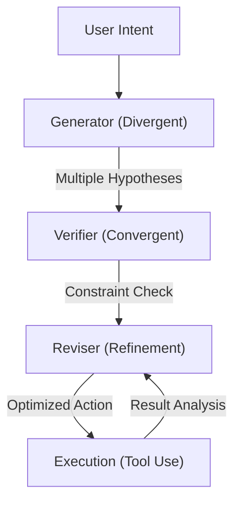

> [!IMPORTANT]
> **AI Assist Note (Knowledge Heritage)**:
> This document is part of the "Sovereign Reality" documentation.
> - **@docs ARCHITECTURE:Core**
> - **Failure Path**: Information drift, legacy terminology, or documentation mismatch.
> - **Telemetry Link**: Search `[GEMINI]` in audit logs.
>
> ### AI Assist Note
> Core technical resource for the Tadpole OS Sovereign infrastructure.
>
> ### 🔍 Debugging & Observability
> Traceability via `parity_guard.py`.

> [!IMPORTANT]
> **AI Assist Note (Knowledge Heritage)**:
> This document is part of the "Sovereign Reality" documentation.
> - **@docs ARCHITECTURE:Core**
> - **Failure Path**: Information drift, legacy terminology, or documentation mismatch.
> - **Telemetry Link**: Search `[GEMINI]` in audit logs.
>
> ### AI Assist Note
> Operating directive for Tadpole OS agent orchestration.
>
> ### Debugging & Observability
> Traceability via `execution/parity_guard.py`.

---
trigger: always_on
---

# Tadpole Engine: Antigravity Kit (GEMINI.md)
**Intelligence Level**: High (ECC Optimized)
**Source of Truth**: `directives/GEMINI.md`, `directives/IDENTITY.md`
**Last Hardened**: 2026-04-16
**Standard Compliance**: ECC-OS (Enhanced Contextual Clarity - Orchestration Standards)

> [!IMPORTANT]
> **AI Assist Note (Orchestration Logic)**:
> This document is the "Operating System" for all agents in the Tadpole swarm.
> - **Execution Loop**: All complex tasks MUST follow the **Aletheia Protocol** (Generator -> Verifier -> Reviser).
> - **Metadata Mandatory**: Every tool call and response must be traced via `X-Request-Id`.
> - **Self-Correction**: Agents are authorized to perform self-healing retries for JSON malformations (`Self-Healing Retry`).

---

## 🧠 Aletheia Reasoning Flow

---

# GEMINI.md - Antigravity Kit (Compressed)

## 🚨 CRITICAL: AGENT & SKILL PROTOCOL

**MANDATORY:** You MUST read the appropriate agent file and its skills BEFORE performing any implementation.

### 1. Skill Loading & Enforcement
**Activate**: Read Rules → Check Frontmatter → Read `SKILL.md` (Selective Reading: only request-specific) → Apply All.
**Forbidden**: Never skip rules. "Read → Understand → Apply" is mandatory.

---

## 🧠 Aletheia Reasoning Protocol (CORE OS)

**All agents must think before they act.**

1. **Generator (Divergent)**: Explore options, hypotheses, and user context. Don't pick the first solution.
2. **Verifier (Convergent)**: Explicit checks for hallucinations ("Am I inventing APIs?"), security ("Is this safe?"), and constraints ("Does this break existing code?"). Use `clippy` and `fmt` as truth-anchors.
3. **Reviser (Refinement)**: Optimize for brevity, performance, and clarity.
4. **Strategic Compaction (Asset Management)**: 
   - **Tuning**: Flush the context window via `/compact` at key milestones (e.g., after an approved implementation plan, before a major refactor). 
   - **Persistence**: Ensure critical results (PR numbers, file paths) are written to a `{task-slug}.md` *before* compacting.

---

## 🛡️ Security & Safety Protocol (GLOBAL)

1. **Zero Trust**: Validate ALL inputs, even internal ones.
2. **No Secrets**: Use env vars, never hardcode.
3. **Least Privilege**: Ask only for needed permissions.
4. **Safe Failure**: Fail gracefully without crashing the stack.
5. **Guardrails**: Confirm destructive commands specific to the user's OS.

---

## 📥 & 🤖 CLASSIFICATION & ROUTING

**Step 1: Classify Request**
- **Simple** (fix, add, change): Inline Edit.
- **Complex** (build, create, refactor, design): Requires `{task-slug}.md`.
- **Slash Cmd** (/create, /debug): Run command flow.

**Step 2: Auto-Select Agent**
> **MANDATORY**: Follow `@[skills/intelligent-routing]`. Detect domain (Frontend/Backend/Sec) and apply specialist.
> **Announce**: `🤖 Applying knowledge of @[agent]...`

**Routing Checklist**:
1. Identify correct agent?
2. READ agent's `.md` file?
3. Announced agent?
4. Loaded skills?
*Failure = Protocol Violation.* Self-Check: "Have I completed the Checklist?"

---

## TIER 0: UNIVERSAL RULES

- **Language**: Translate strictly internally, respond in user's language. Code comments in English.
- **Clean Code**: Follow `@[skills/clean-code]`. Concise, tested (Pyramid/AAA), performant (2025 standards), safe (5-Phase Deployment).
- **Dependencies**: Check `package.json` and `server-rs/Cargo.toml`. Identify dependent files, update all together.
- **System Map**: Read `SYSTEM_MAP.md` at start. Understand Modular Skills (`execution/core/`) & Registry (`execution/skills/`).

**Read → Understand → Apply**: Answer "What is the GOAL? What PRINCIPLES? How does this DIFFER?" before coding.

**ECC Hybrid Optimization**:
- **Active Quality Gates**: Use explicit verification commands such as `npm run build`, `npm run test`, and `cargo test --manifest-path server-rs/Cargo.toml` to flag regressions.
- **Surgical Repairs**: Leverage the "Surgical Fix Tables" in `rust-pro` skill to solve borrow checker issues in 1-2 turns.
- **Resource Efficiency**: Use `Haiku/Flash` for lints/docs to preserve tokens for complex reasoning in `Sonnet/Opus`.

---

## 📊 High-Value AI Observability (NEW)

**The Tadpole OS codebase is "AI-Indexable". Use these resources to resolve issues with minimal token usage.**

1. **Error Resolution**: Check terminal output, `server-rs/errors.txt`, `server-rs/logs.txt`, `scratch/server.err`, and `sidecar_panic.log` when present.
2. **Telemetry Tracing**: Trace emitters through `server-rs/src/telemetry/`, `server-rs/src/startup.rs`, `server-rs/src/router.rs`, and WebSocket consumers in `src/services/`.
3. **Modular Skills**: Use the **`BaseSkill`** framework in `execution/core/` for new tools when the existing skill registry pattern fits.
4. **Service Context**: Prefer source-level comments and the docs in `README.md`, `SYSTEM_MAP.md`, and `docs/ARCHITECTURE.md` for current dependencies and side effects.

> [!TIP]
> From now on, when troubleshooting, you can simply ask an AI agent to "Check the Error Registry for 'X'" or "Trace the Telemetry Link for 'Y'" to resolve issues in seconds.

---

## TIER 1: CODE RULES

### 📱 Project Types
- **Mobile** (iOS/Android/Flutter) → `mobile-developer` + `mobile-design`
- **Web** (React/Next) → `frontend-specialist` + `frontend-design`
- **Backend** (API/DB) → `backend-specialist` + `api-patterns`
*(Mobile + Frontend-specialist = WRONG)*

### 🛑 Socratic Gate (Mandatory)
**BEFORE tool use/implementation:**
- **New Feature/Build**: Deep Discovery (3+ questions).
- **Code Edit/Fix**: Context Check.
- **Specs provided?**: Ask about Trade-offs/Edge Cases.
- **Protocol**: `@[skills/brainstorming]`. never assume.

### 🏁 Final Checklist
Trigger: "final checks", "son kontrolleri yap", "çalıştır tüm testleri".
1. **Manual Audit**: `python execution/sovereign_audit.py`
2. **Pre-Deploy**: `python execution/verify_all.py . --url <URL>`
*Execution Order: Security → Lint → Schema → Tests → UX → SEO → E2E*
*Fix Critical blockers first.*

### 🎭 Gemini Modes
- **Plan Mode** (`project-planner`): Analysis -> Planning (`{task-slug}.md`) -> Solutioning -> NO CODE.
- **Edit Mode** (`orchestrator`): Execute. If structural/multi-file change -> `{task-slug}.md`.

---

## TIER 2: DESIGN RULES
**Visual Source of Truth**: Before any UI work, inspect `src/index.css`, `src/constants/theme.ts`, `src/components/ui/theme_tokens.ts`, and the nearest existing page/component patterns.

**Read Agent Definitions**: use available specialist directives and skills for the target domain when present.
*Rules: No Purple, No Templates, Anti-cliché, Deep Design Thinking.*

---

## 📁 QUICK REF
- **Core Framework**: `BaseSkill` (`execution/core/base_skill.py`), `SkillRegistry` (`execution/core/registry.py`).
- **Masters**: `orchestrator`, `project-planner`, `backend-specialist`, `frontend-specialist`.
- **Scripts**: `tadpole_mcp_server.py`, `parity_guard.py`, `checklist.py`, `security_scan.py`.

[//]: # (Metadata: [GEMINI])

[//]: # (Metadata: [GEMINI])
