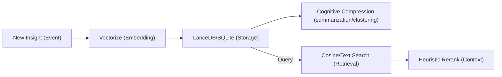

> [!IMPORTANT]
> **AI Assist Note (Knowledge Heritage)**:
> This document is part of the "Sovereign Reality" documentation.
> - **@docs ARCHITECTURE:Core**
> - **Failure Path**: Information drift, legacy terminology, or documentation mismatch.
> - **Telemetry Link**: Search `[LONG_TERM_MEMORY]` in audit logs.
>
> ### AI Assist Note
> 🧠 Tadpole Engine: Persistent Ledger (Long-Term Memory)
>
> ### 🔍 Debugging & Observability
> Traceability via `parity_guard.py`.

# 🧠 Tadpole Engine: Persistent Ledger (Long-Term Memory)
**Intelligence Level**: High (ECC Optimized)
**Source of Truth**: `server-rs/src/memory.rs`, `directives/LONG_TERM_MEMORY.md`
**Last Hardened**: 2026-04-01
**Standard Compliance**: ECC-MEM (Enhanced Contextual Clarity - Memory Standards)

> [!IMPORTANT]
> **AI Assist Note (Memory Logic)**:
> This document governs the "Split-Brain" architecture of Tadpole OS.
> - **Primary Core**: SQLite handles relational metadata, logs, and fallback memories for non-vector builds.
> - **Neural Core**: LanceDB handles vector embeddings (Semantic Recall) when enabled.
> - **Cognitive Core**: The Tiered Memory Controller runs background compression, summarizing episodic memories into semantic knowledge.
> - **Sync Policy**: All writes are debounced (10s) via `memory.rs`.

---

## 🧠 Memory Lifecycle & Retrieval

---

# Long-Term Memory (Persistent Ledger)

Last Updated: 2026.06.24

## Key Learnings
- **Tiered Cognitive Memory pipeline**: Memory is no longer just a plugin, but the spine of the OS. Short-term episodic memories are monitored and compressed into long-term knowledge using background summarization and clustering, triggered automatically based on configurable thresholds.
- **SQLite Fallback Memories**: If the `vector-memory` feature is disabled, the OS falls back to a relational SQLite-based memory table (`fallback_memories`), enabling query and search capabilities without LanceDB.
- **Optimized Symbol Graph Engine**: The Code Graph `/v1/intelligence/graph` and `/v1/intelligence/blast-radius` REST APIs are fully optimized, secure, and ready at start. Edge compilation features an $O(N + M)$ HashMap name lookup index, traversals utilize zero-copy BFS logic to remove heap allocator pressure, and queries incorporate salted folder-path obfuscation to prevent structural exposure (Verification: 100% passing test parity suite and sovereign audit compliance).

## Session Markers
- Initializing high-security agentOS enhancements.

[//]: # (Metadata: [LONG_TERM_MEMORY])
