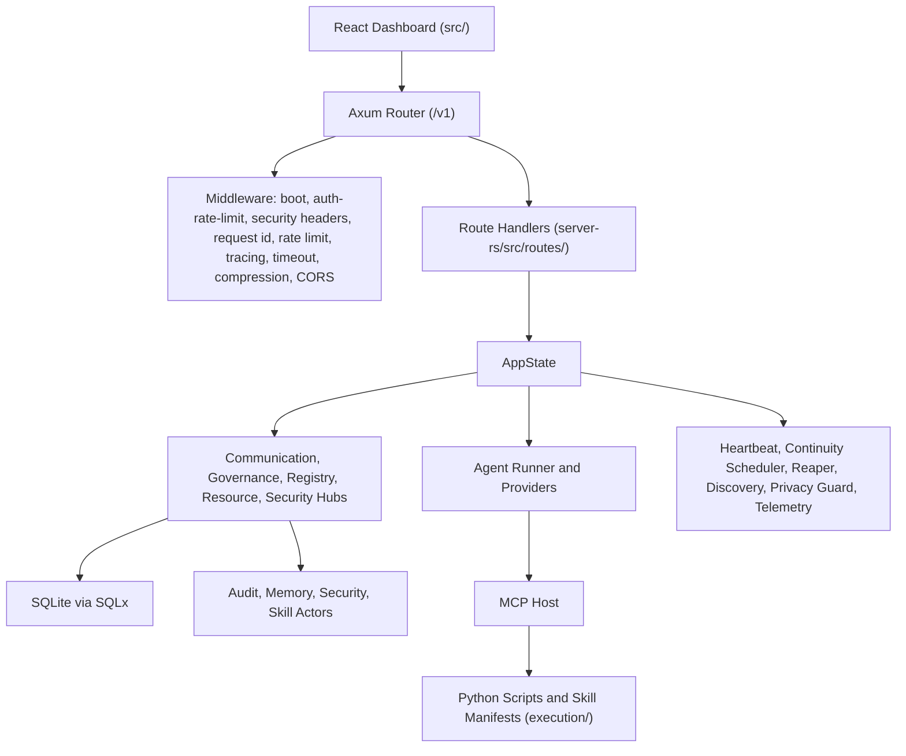

> [!IMPORTANT]
> **AI Assist Note (Knowledge Heritage)**:
> This document is part of the "Sovereign Reality" documentation.
> - **@docs ARCHITECTURE:Documentation**
> - **Failure Path**: Information drift, legacy terminology, or documentation mismatch.
> - **Telemetry Link**: Search `[ARCHITECTURE]` in audit logs.
>
> ### AI Assist Note
> Core technical resource for the Tadpole OS Sovereign infrastructure.
>
> ### 🔍 Debugging & Observability
> Traceability via `parity_guard.py`.

> [!IMPORTANT]
> **AI Assist Note (Knowledge Heritage)**:
> This document is part of the "Sovereign Reality" documentation.
> - **@docs ARCHITECTURE:Documentation**
> - **Failure Path**: Information drift, legacy terminology, or documentation mismatch.
> - **Telemetry Link**: Search `[ARCHITECTURE]` in audit logs.
>
> ### AI Assist Note
> Tadpole OS architecture.
>
> ### Debugging & Observability
> Traceability via `execution/parity_guard.py`.

# Tadpole OS Architecture

Tadpole OS is a local-first agent operations platform with a React dashboard, a Rust Axum engine, SQLite persistence, and a Python execution layer for skills and MCP tools.

## High-Level Runtime

## Layers

| Layer | Paths | Responsibilities |
| --- | --- | --- |
| Interface | `src/` | Dashboard pages, layout, stores, hooks, API clients, browser inference, visual monitoring, and detached windows. |
| Engine | `server-rs/src/` | HTTP/WebSocket API, AppState, agent runner, providers, middleware, security, telemetry, actors, and background workers. |
| Execution | `execution/` | Python tools, JSON skill manifests, MCP host, verification utilities, skill templates, and modular skill framework. |
| Persistence | `data/`, `server-rs/migrations/` | SQLite database, migration scripts, runtime registries, and cache files. |
| Directives and docs | `directives/`, `docs/` | Governance documents, operating directives, API reference, OpenAPI, and operations documentation. |

## Engine Boot Sequence

The engine starts in `server-rs/src/main.rs`.

1. Installs a panic hook that writes `sidecar_panic.log`.
2. Applies `WORKSPACE_ROOT` by changing the process working directory when configured.
3. Builds a custom Tokio runtime.
4. Handles fast-path CLI options such as `--version`, `--help`, and `--status`.
5. Loads `.env` and validates environment schema behavior through `startup::load_environment`.
6. Initializes tracing and OpenTelemetry unless disabled.
7. Creates `AppState`, including the database pool, registries, hubs, security services, MCP host, and skill registry.
8. Starts background tasks from `startup::spawn_background_tasks`.
9. Spawns system actors and attaches the actor registry.
10. Launches the orchestrator loop.
11. Builds the Axum router and binds to `BIND_ADDRESS:PORT`, defaulting to `127.0.0.1:8000`.
12. Signals boot completion, serves requests, and flushes state during graceful shutdown.

## AppState Hubs

`server-rs/src/state/mod.rs` decomposes runtime state into hubs:

| Hub | Purpose |
| --- | --- |
| CommunicationHub | Broadcast logs, events, telemetry, audio streams, pulse data, oversight queues, and active runners. |
| GovernanceHub | Runtime limits, privacy mode, budgets, active agent counters, recruitment counts, and depth constraints. |
| RegistryHub | Agents, providers, models, nodes, skills, MCP host, hooks, and tool registry. |
| ResourceHub | SQLite pool, HTTP client, audio cache, code graph, parser, hardware profiler, ACL, renderer, and semaphores. |
| SecurityHub | Audit trail, budget guard, shell scanner, secret redactor, security monitor, permission policy, and deploy token. |

## Routing And Middleware

`server-rs/src/router.rs` nests routes under `/v1` and applies:

- boot readiness middleware
- auth brute-force limiter
- security headers
- request ID injection
- rate-limit headers
- tracing spans
- deprecation middleware
- 120-second timeout
- compression
- CORS

Public routes:

- `GET /v1/engine/health`
- `GET /v1/engine/ws`
- `GET /v1/engine/live-voice`

Protected route groups require `Authorization: Bearer <NEURAL_TOKEN>`:

- agents, oversight, infrastructure, model manager, skills, benchmarks, continuity, docs, system, governance, sovereign session state, memory search, engine control, and MCP bridge routes.

When `STATIC_DIR` exists, defaulting to `dist`, the router serves the dashboard build and falls back to `index.html` for client-side routing.

## Background Workers

`server-rs/src/startup.rs` starts runtime workers:

- CodeGraph warmup for source indexing in full boot mode.
- Heartbeat event loop that emits `engine:health`.
- Continuity scheduled job executor.
- Swarm reaper with retention behavior.
- Optional vector-memory cleanup behind the `vector-memory` feature.
- SME connector ingestion worker.
- mDNS swarm discovery in full boot mode.
- Privacy guard.
- Rate-limit bucket eviction.
- Telemetry metric aggregation.
- Debounced budget usage flush.
- High-speed swarm pulse loop in full boot mode.
- Declarative swarm recipe ingestion.

## Frontend Architecture

`src/App.tsx` initializes the dashboard runtime:

- provider defaults and backend provider sync
- visual monitor bridge
- VRAM monitor service
- optional browser inference pre-warm when sentinel mode is enabled
- agent registry hydration
- theme and density attributes
- route-to-tab synchronization

Routes are registered in `src/constants/routes.ts` and rendered through `Dashboard_Layout`.

## Persistence

- Default database: `sqlite:<workspace>/data/tadpole.db`.
- Override with `DATABASE_URL`.
- Migrations live in `server-rs/migrations/`.
- Providers and models are persisted during graceful shutdown.
- Agent records are loaded from SQLite and saved through batched database writes.
- Audio cache defaults to `data/audio_cache.db`.

## Feature Gates

Default Cargo features are empty.

| Feature | Effect |
| --- | --- |
| `vector-memory` | Enables LanceDB/Arrow-backed memory routes and cleanup. Without it, memory endpoints return `501 Not Implemented`. |
| `neural-audio` | Enables optional audio/native dependencies. |

## Code Intelligence & Blast Radius Engine

Tadpole OS integrates a high-fidelity **Code Intelligence & Blast Radius Engine** (`server-rs/src/intelligence/`):

- **In-Memory Dependency Graph**: Builds a directed symbol graph of all functions, structs, classes, and interfaces across the Rust and TypeScript codebase.
- **Visual Force-Directed Layout**: The frontend renders this dependency graph dynamically under the **Neural Map** page using `react-force-graph-2d` for interactive exploration.
- **Blast Radius Analysis**: Traces incoming edges to calculate the downstream impact of editing any specific code symbol, returning all files and functions that depend on it.
- **Autonomous Agent Integration**: Exposed as a native agent tool (`get_blast_radius`), enabling the agent swarm to inspect dependencies prior to performing code edits, preventing compilation regressions and "half-baked" edits.

## Sovereign Engine Hardening

The engine implements several strategies to ensure resilience and zero-panic operation:

- **Self-Annealing Intelligence**: The `PolyglotParser` provides structured feedback on malformed tool calls, allowing the `IntelligenceLoop` to automatically re-prompt models for correction.
- **Panic Remediation**: Critical paths in the bridge, parser, and security modules use safe error propagation (via `Result` and `AppError`) rather than non-recoverable panics.
- **Non-Blocking Orchestration**: All filesystem I/O in the MCP execution and Memory Palace rehydration modules is migrated to `tokio::fs` to prevent event-loop stalling.

[//]: # (Metadata: [ARCHITECTURE])

[//]: # (Metadata: [ARCHITECTURE])
