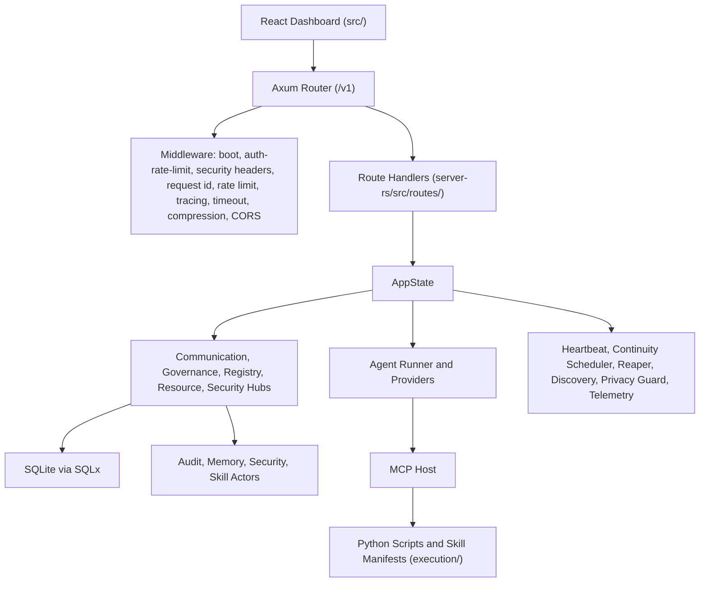

> [!IMPORTANT]
> **AI Assist Note (Knowledge Heritage)**:
> This document is part of the "Sovereign Reality" documentation.
> - **@docs ARCHITECTURE:Documentation**
> - **Failure Path**: Information drift, legacy terminology, or documentation mismatch.
> - **Telemetry Link**: Search `[ARCHITECTURE]` in audit logs.
>
> ### AI Assist Note
> Core technical resource for the Tadpole OS Sovereign infrastructure.
>
> ### 🔍 Debugging & Observability
> Traceability via `parity_guard.py`.

# Tadpole OS Architecture

Tadpole OS is a local-first agent operations platform with a React dashboard, a Rust Axum engine, SQLite persistence, and a Python execution layer for skills and MCP tools.

## High-Level Runtime

```mermaid
flowchart TD
  UI["React Dashboard (src/)"] --> Router["Axum Router (/v1)"]
  Router --> Middleware["Middleware: boot, auth-rate-limit, security headers, request id, rate limit, tracing, timeout, compression, CORS"]
  Router --> Routes["Route Handlers (server-rs/src/routes/)"]
  Routes --> AppState["AppState"]
  AppState --> Hubs["Communication, Governance, Registry, Resource, Security Hubs"]
  Hubs --> DB["SQLite via SQLx"]
  Hubs --> Actors["Audit, Memory, Security, Skill Actors"]
  AppState --> AgentRunner["Agent Runner and Providers"]
  AgentRunner --> MCP["MCP Host"]
  MCP --> Execution["Python Scripts and Skill Manifests (execution/)"]
  AppState --> Workers["Heartbeat, Continuity Scheduler, Reaper, Discovery, Privacy Guard, Telemetry"]
```

## Layers

| Layer | Paths | Responsibilities |
| --- | --- | --- |
| Interface | `src/`, `src/services/telemetry_buffer.ts` | Dashboard pages, layout, stores, hooks, API clients, IndexedDB rolling telemetry cache (7-day TTL), and detached windows. |
| Engine | `server-rs/src/` | HTTP/WebSocket API, AppState, agent runner, providers, middleware, security, telemetry, actors, and background workers. |
| Token & Context | `server-rs/src/agent/tokenizer.rs`, `server-rs/src/agent/context_manager.rs`, `server-rs/src/agent/context_slicer.rs` | Model-aware BPE token counting (< 1µs DashMap LRU cache), 2-Tier context compression, and adaptive 3-zone context slicing with strict `tiktoken` budget enforcement. |
| OTP Supervision | `server-rs/src/system/actors/supervisor.rs`, `server-rs/src/system/actors/manager.rs` | Erlang/OTP-style supervision tree with `OneForOne`/`OneForAll` strategies, `AbortHandle` deterministic shutdown, stability-based exponential backoff, and `DashMap` child registry. |
| Hybrid RAG Fusion | `server-rs/src/services/rag_fusion.rs` | Reciprocal Rank Fusion (RRF) combining LanceDB Vector, BM25 Lexical, and TrustGraph Entity search with multi-engine intersection boosting. |
| Durable Workflows | `server-rs/src/agent/durable.rs`, `server-rs/migrations/20260822000100_durable_workflows.sql` | SQLite-native step memoization with SHA-256 parameter hashing, crash fast-forwarding, and mutation-aware re-execution. |
| Socratic Contracts | `server-rs/src/agent/socratic.rs` | 0-Turn Socratic contract envelope auto-injection (Scope, Performance Threshold, Architecture Mode, Pre-Cleared Failure Policies) with typed `BlastRadiusLevel` and zero-allocation `Cow<str>`. |
| Swarm Pulse Telemetry | `server-rs/src/telemetry/pulse.rs` | Real-time MessagePack pulse stream with dynamic reasoning turn progress calculation (`progress: f32`) and auto-constructed parent-child hierarchical edges (`PulseConnection`). |
| Swarm Orchestration | `server-rs/src/agent/dag.rs`, `server-rs/src/agent/blackboard.rs`, `server-rs/src/agent/cascade_router.rs`, `server-rs/src/agent/verification_gate.rs` | Dynamic DAG task parallelism, shared mission blackboard, tiered model cascading, and zero-trust Aletheia verification gate. |
| Tool & Skill Dispatch | `server-rs/src/agent/runner/tools/mod.rs`, `server-rs/src/agent/script_skills.rs` | Zero-Trust pipeline (Budget Check -> Token Validation -> WAL -> CBS -> Oversight -> Sandboxed Subprocess Execution), atomic snapshot capability registry (`DashMap`), auto-discovery for `.py`/`.sh`/`.ps1`, and deterministic disk script trapping. |
| Subsystems | `server-rs/src/agent/trustgraph.rs`, `server-rs/src/services/bm25_memory.rs`, `server-rs/src/routes/a2a.rs` | TrustGraph GraphRAG entity traversal, BM25 Lexical search engine (< 1ms), and A2A 2PC budget ledger. |
| Execution | `execution/` | Python tools, JSON skill manifests, MCP host, `tool_loop_guard.py` circuit breaker, `evaluate_annealing.py`, and skill framework. |
| Persistence | `data/`, `server-rs/migrations/` | SQLite database, migration scripts (`20260725000100`–`20260822000100`), runtime registries, and cache files. |
| Directives and docs | `directives/`, `docs/` | Governance documents, operating directives, API reference, OpenAPI, and operations documentation. |

## Engine Boot Sequence

The engine starts in `server-rs/src/main.rs`.

1. Installs a panic hook that writes `sidecar_panic.log`.
2. Applies `WORKSPACE_ROOT` by changing the process working directory when configured.
3. Builds a custom Tokio runtime.
4. Handles fast-path CLI options such as `--version`, `--help`, and `--status`.
5. Loads `.env` and validates environment schema behavior through `startup::load_environment`.
6. Initializes tracing and OpenTelemetry unless disabled.
7. Creates `AppState`, including the database pool, registries, hubs, security services, MCP host, and skill registry.
8. Starts background tasks from `startup::spawn_background_tasks`.
9. Spawns system actors under OTP supervisor tree and attaches the actor registry.
10. Launches the orchestrator loop.
11. Builds the Axum router and binds to `BIND_ADDRESS:PORT`, defaulting to `127.0.0.1:8000`.
12. Signals boot completion, serves requests, and flushes state during graceful shutdown.

## AppState Hubs

`server-rs/src/state/mod.rs` decomposes runtime state into hubs:

| Hub | Purpose |
| --- | --- |
| CommunicationHub | Broadcast logs, events, telemetry, audio streams, pulse data, oversight queues, and active runners. |
| GovernanceHub | Runtime limits, privacy mode, budgets, active agent counters, recruitment counts, and depth constraints. |
| RegistryHub | Agents, providers, models, nodes, skills, MCP host, hooks, and tool registry. |
| ResourceHub | SQLite pool, HTTP client, audio cache, code graph, parser, hardware profiler, ACL, renderer, and semaphores. |
| SecurityHub | Audit trail, budget guard, shell scanner, secret redactor, security monitor, permission policy, and deploy token. |

## Routing And Middleware

`server-rs/src/router.rs` nests routes under `/v1` and applies:

- boot readiness middleware
- auth brute-force limiter
- security headers
- request ID injection
- rate-limit headers
- tracing spans
- deprecation middleware
- 120-second timeout
- compression
- CORS

Public routes:

- `GET /v1/engine/health`
- `GET /v1/engine/ws`
- `GET /v1/engine/live-voice`

Protected route groups require `Authorization: Bearer <NEURAL_TOKEN>`:

- agents, oversight, infrastructure, model manager, skills, benchmarks, continuity, docs, system, governance, sovereign session state, memory search (including `/v1/memory/search/hybrid` for Triad RRF), engine control, and MCP bridge routes.

When `STATIC_DIR` exists, defaulting to `dist`, the router serves the dashboard build and falls back to `index.html` for client-side routing.

## Background Workers

`server-rs/src/startup/mod.rs` starts runtime workers:

- CodeGraph warmup for source indexing in full boot mode.
- Heartbeat event loop that emits `engine:health`.
- Continuity scheduled job executor.
- Swarm reaper with retention behavior.
- Optional vector-memory cleanup behind the `vector-memory` feature.
- SME connector ingestion worker.
- mDNS swarm discovery in full boot mode.
- Privacy guard.
- Rate-limit bucket eviction.
- Telemetry metric aggregation.
- Debounced budget usage flush.
- High-speed swarm pulse loop in full boot mode.
- Declarative swarm recipe ingestion.

## Frontend Architecture

`src/App.tsx` initializes the dashboard runtime:

- provider defaults and backend provider sync
- visual monitor bridge
- VRAM monitor service
- optional browser inference pre-warm when sentinel mode is enabled
- agent registry hydration
- theme and density attributes
- route-to-tab synchronization

Routes are registered in `src/constants/routes.ts` and rendered through `Dashboard_Layout`.

## Persistence

- Default database: `sqlite:<workspace>/data/tadpole.db`.
- Override with `DATABASE_URL`.
- Migrations live in `server-rs/migrations/` (includes `20260822000100_durable_workflows.sql` for durable step memoization).
- Providers and models are persisted during graceful shutdown.
- Agent records are loaded from SQLite and saved through batched database writes.
- Audio cache defaults to `data/audio_cache.db`.

## Feature Gates

Default Cargo features are empty.

| Feature | Effect |
| --- | --- |
| `vector-memory` | Enables LanceDB/Arrow-backed memory routes and cleanup. Without it, memory endpoints return `501 Not Implemented`. |
| `neural-audio` | Enables optional audio/native dependencies. |

## Code Intelligence & Blast Radius Engine

Tadpole OS integrates a high-fidelity **Code Intelligence & Blast Radius Engine** (`server-rs/src/intelligence/`):

- **In-Memory Dependency Graph**: Builds a directed symbol graph of all functions, structs, classes, and interfaces across the Rust and TypeScript codebase.
- **Visual Force-Directed Layout**: The frontend renders this dependency graph dynamically under the **Neural Map** page using `react-force-graph-2d` for interactive exploration.
- **Blast Radius Analysis**: Traces incoming edges to calculate the downstream impact of editing any specific code symbol, returning all files and functions that depend on it.
- **Autonomous Agent Integration**: Exposed as a native agent tool (`get_blast_radius`), enabling the agent swarm to inspect dependencies prior to performing code edits, preventing compilation regressions and "half-baked" edits.
- **Lock Decoupling & Token Caching**: File discovery and parsing are performed outside the RwLock read/write guards, preventing concurrency starvation. Symbol token counts are pre-calculated and cached on node compilation to yield zero-overhead BFS context resolution.

## Sovereign Engine Hardening

The engine implements several strategies to ensure resilience and zero-panic operation:

- **OTP Actor Supervision Tree** (`server-rs/src/system/actors/supervisor.rs`): Erlang/OTP-style supervision engine supporting `OneForOne` (restart individual) and `OneForAll` (cascade restart) strategies with `AbortHandle` deterministic hard shutdown, exponential backoff with stability-based reset, and lockless `DashMap` child registry.
- **Durable Workflow Step Memoization** (`server-rs/src/agent/durable.rs`): SQLite-native crash-resilient execution engine. Completed agent workflow steps are SHA-256 hashed and cached; on engine restart, previously completed steps are fast-forwarded from SQLite with zero token waste.
- **Aletheia Verification Gate** (`server-rs/src/agent/verification_gate.rs`): Zero-trust dual-agent verification for high-impact mutations. Enforces independent Verifier blast-radius calculation to mitigate the "Honesty Problem" of generator self-reporting.
- **Self-Annealing Intelligence**: The `PolyglotParser` provides structured feedback on malformed tool calls, allowing the `IntelligenceLoop` to automatically re-prompt models for correction.
- **Panic Remediation**: Critical paths in the bridge, parser, and security modules use safe error propagation (via `Result` and `AppError`) rather than non-recoverable panics.
- **Non-Blocking Orchestration**: All filesystem I/O in the MCP execution and Memory Palace rehydration modules is migrated to `tokio::fs` to prevent event-loop stalling.
- **Lock-free Read Queries**: Read-based code graph queries execute concurrently while workspace scans compile on background blocking threads, preventing request timeouts.

## Swarm Orchestration Engine

The Next-Gen Swarm Orchestration layer provides five production-grade subsystems:

| Subsystem | Module | Purpose |
| --- | --- | --- |
| Dynamic DAG Task Engine | `server-rs/src/agent/dag.rs` | Directed task dependency graph with `petgraph::StableDiGraph`, topological cycle rejection, parallel ready-queue extraction, state transition validation, and deadlock-free failure cascading via BFS `Skipped` propagation. |
| Shared Mission Blackboard | `server-rs/src/agent/blackboard.rs` | High-performance thread-safe in-memory scratchpad (`DashMap` + `Arc<BlackboardEntry>`) for multi-agent data exchange, replacing large prompt string passing with lightweight key pointers. |
| Tiered Model Cascade Router | `server-rs/src/agent/cascade_router.rs` | Dynamic turn routing between Tier 1 Fast (Ollama/Groq/Gemini Flash) and Tier 2 Frontier Reasoning (Gemini Pro/Claude/GPT-4o) with configurable critical keywords and capability-aware error escalation. |
| Aletheia Verification Gate | `server-rs/src/agent/verification_gate.rs` | Zero-trust Generator→Verifier triad for high-impact mutations with `HashSet` O(1) sensitive skill gating and independent Verifier blast-radius evaluation. |
| Adaptive Context Slicer | `server-rs/src/agent/context_slicer.rs` | Cognitive 3-zone prompt assembly (Pinned Anchors, `<grounded_context>` RAG, Sliding Active Window) with strict `tiktoken` BPE token budget enforcement and pre-allocated heap buffers. |

## Hybrid RAG Triad Fusion

The retrieval layer fuses three complementary search engines using **Reciprocal Rank Fusion (RRF)** (`server-rs/src/services/rag_fusion.rs`):

$$RRF\_Score(d) = \sum_{e \in \{\text{Vector}, \text{BM25}, \text{Graph}\}} \frac{w_e}{k + rank_e(d)}$$

| Engine | Weight | Module |
| --- | --- | --- |
| LanceDB Vector | 0.40 | `server-rs/src/agent/memory.rs` |
| BM25 Lexical | 0.35 | `server-rs/src/services/bm25_memory.rs` |
| TrustGraph Entity | 0.25 | `server-rs/src/agent/trustgraph.rs` |

Exposed via `GET /v1/memory/search/hybrid` for unified multi-engine retrieval with deduplication and intersection boosting.

[//]: # (Metadata: [ARCHITECTURE])
