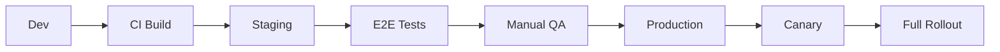

> [!IMPORTANT]
> **AI Assist Note (Knowledge Heritage)**:
> This document is part of the "Sovereign Reality" documentation.
> - **@docs ARCHITECTURE:Core**
> - **Failure Path**: Information drift, legacy terminology, or documentation mismatch.
> - **Telemetry Link**: Cross-reference with `execution/parity_guard.py` results.
>
> ### AI Assist Note
> Automated governance and architectural tracking.
>
> ### 🔍 Debugging & Observability
> Traceability via `parity_guard.py`.

> [!IMPORTANT]
> **AI Assist Note (Knowledge Heritage)**:
> This document is part of the "Sovereign Reality" documentation.
> - **@docs ARCHITECTURE:Core**
> - **Failure Path**: Information drift, legacy terminology, or documentation mismatch.
> - **Telemetry Link**: Cross-reference with `execution/parity_guard.py` results.

---
name: deploy-cycle
description: Standard procedure for deploying code from development to production.
---

# Deployment Protocol

The deployment cycle ensures code moves safely from a developer's machine to production users without causing downtime.

## Architecture

### 1. CI Build (Continuous Integration)
Run unit tests, linting, and build validation on every commit.

### 2. Staging Deployment
Deploy build to a production-mirror environment. Connects to test databases.

### 3. Verification
- **Automated**: E2E tests run against staging.
- **Manual**: QA/Product team verifies the user experience.

### 4. Production Release
- **Canary**: Deploy to 1-5% of traffic. Monitor error rates.
- **Full Rollout**: Promote to 100% if Canary is healthy.

## When to Use
- **Feature Release**: Shipping new functionality.
- **Hotfix**: Patching a production bug.

## Operational Principles
1. **Automate Everything**: Humans make mistakes; scripts don't.
2. **Blue/Green Deployment**: Always have a way to switch back instantly.
3. **Observability**: Metrics must be visible *during* the deploy.

[//]: # (Metadata: [deploy_cycle])

[//]: # (Metadata: [deploy_cycle])
